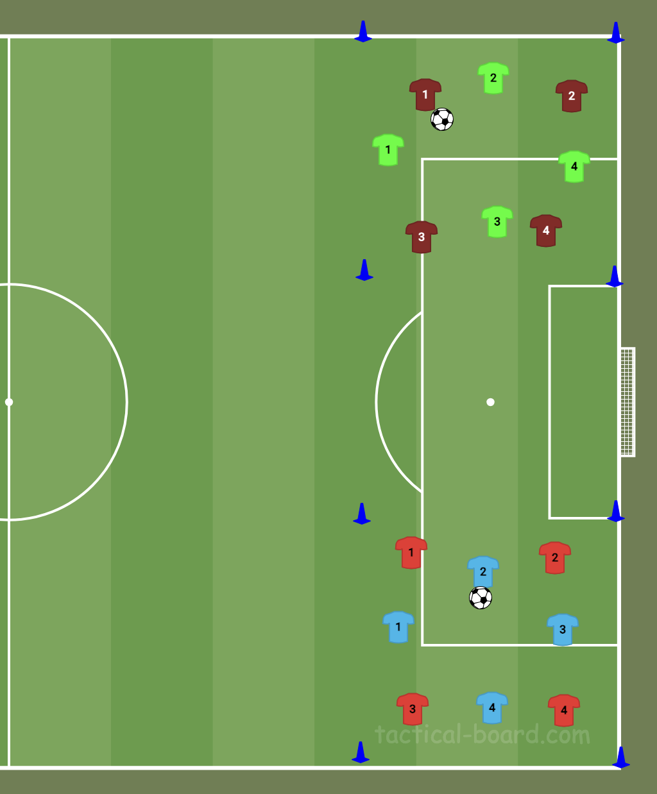

# 4v4 overspelen in een vierkant

<!-- tekening nog maken:  -->

**Thema:** balbezit houden, vrijlopen, aanspeelbaar zijn. Vervangt het tikkertje als opening — zelfde losmaak-functie, maar met structuur.

## Waarom deze
Training 1: tikkertje met zestien tegelijk werd chaos, in twee groepen van acht luisterden ze prima. Deze vorm houdt de groepen klein, kost minder loopwerk dan tikkertje, en traint meteen iets nuttigs.

## Opstelling
Twee vierkanten naast elkaar, elk ongeveer 20 bij 20 meter, afgezet met pionnen. Per vierkant 4 tegen 4 in verschillende hesjes. Bij een oneven aantal spelers: één **joker** met een derde kleur hesje, die altijd meedoet met de partij die de bal heeft.

## Verloop
1. De partij met de bal probeert over te spelen zonder balverlies.
2. **Zes** keer overspelen achter elkaar = 1 punt. Daarna gaat het spel gewoon door.
3. Bal uit of afgepakt: de andere partij begint bij nul.
4. Loopt het lekker, verhoog naar acht. Lukt zes niet binnen een paar minuten, verlaag naar vier of maak het vierkant groter.

## Coachpunten
- Beweeg als je géén bal hebt — een vrije man is een aanspeelbare man.
- Breed en diep blijven, niet allemaal naar de bal toe lopen.
- Kijken vóór je de bal krijgt, niet erna.
- Bal laag en hard inspelen.

## Variatie / opbouw
- Aantal passes ophogen.
- Vierkant kleiner maken = meer druk.
- Maximaal twee keer raken.
- Later: twee kleine doeltjes erbij, zodat er na X passes gescoord mag worden — dan zit de omschakeling er ook in.

## Let op
Zes passes is voor O14 al pittig onder druk. Begin daar en maak het pas zwaarder als het scoort. Tien is te ver weg om leuk te blijven.
