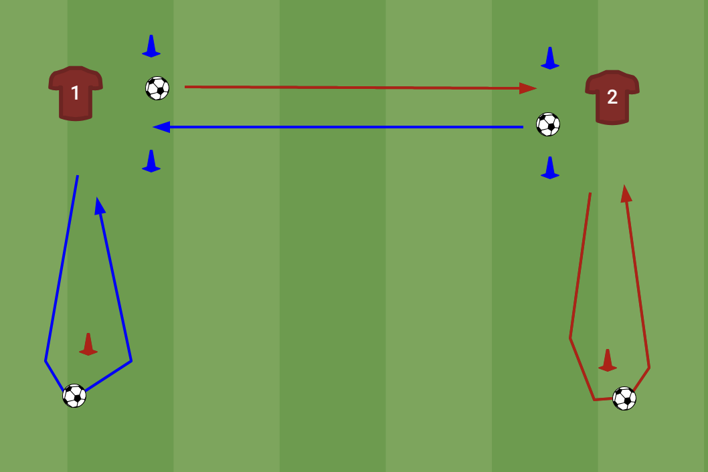

# Aannemen & meenemen (tweetallen)

**Thema:** aannemen met richting, bal niet stilleggen.

## Opstelling
Per tweetal 4 pionnen: 2 startpionnen (waarachter A en B staan om vanaf in te spelen) en 2 kap-pionnen, in de aanspeellijn, iets verder naar buiten dan de startpion. Poortje van blauwe pionnen in het midden waar de pass doorheen moet.

## Verloop
1. A speelt in op B (buitenom de startpion, door het poortje).
2. B neemt aan en kapt om zijn kap-pion.
3. B speelt terug naar A. A doet hetzelfde.
Heen en weer, vast ritme.

## Coachpunten
- Bal vóór je wegnemen, niet plat aannemen en terugtikken.
- Actieve aanname, meteen in de looprichting.
- Op de andere voet laten aannemen als het te makkelijk gaat.

## Variatie / opbouw (over de weken)
- Poortje smaller = scherpere pass.
- Sneller tempo.
- Aannemen op de zwakke voet.
- Later: aannemen onder lichte druk van een verdediger.
