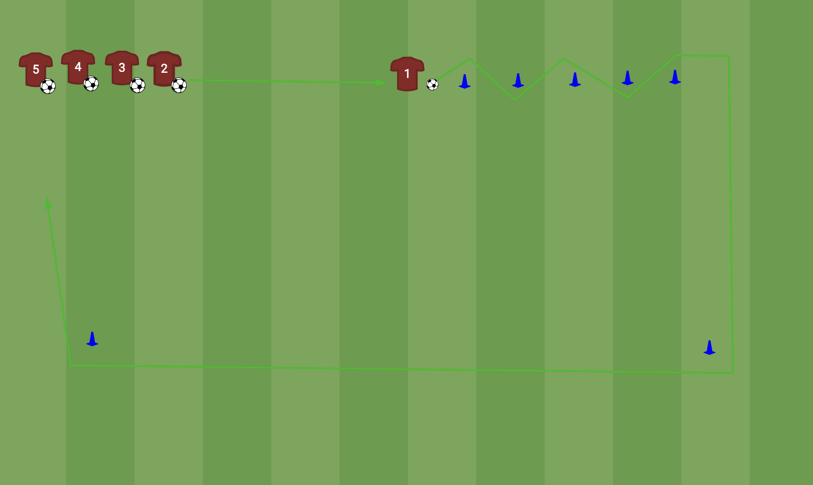

# Slalom pass-en-go (rij)

**Thema:** balcontrole in de slalom + inspelen + dribbelen met richting.

## Opstelling
Rij met bal aan één kant. Pionnenstraatje (zigzag) om doorheen te slalommen. Twee hoekpionnen ruim opzij voor de terugroute, zodat heen- en terugweg elkaar niet kruisen.

## Verloop
1. Voorste uit de rij speelt in op speler 1.
2. Speler 1 slalomt door het straatje.
3. Aan het eind inspelen op de volgende die klaarstaat.
4. Zelf om de hoekpionnen terugdribbelen en achteraan aansluiten.

## Let op (uit training 1)
Met een lange rij staan er te veel stil. **Oplossing: 2 kortere rijen met elk een eigen straatje.** Halveert de wachttijd.

## Coachpunten
- Kleine tikjes in de slalom, bal dichtbij houden.
- Hoofd omhoog voor de pass aan het eind.
- Terugdribbelen = extra balcontact, geen slenteren.

## Variatie / opbouw
- Volgende starten zodra de vorige halverwege is (als basis lekker loopt).
- Heen-en-terug met 2 rijen tegenover elkaar → geen terugloop meer nodig.
- Zwakke voet in de slalom.
